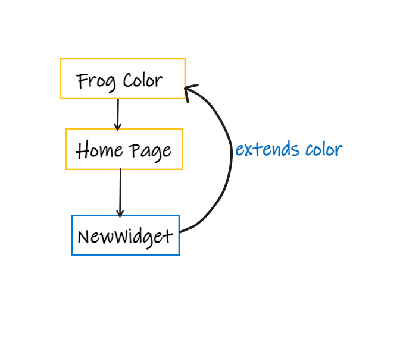

# inherited_widget

In flutter, Inherited widget is a base class which allows those classes to extend information under the tree from it.
Inherited Widgets notifies its registered children when a change occurs.

InheritedWidget is immutable and its attributes are final; therefore,Flutter needs to rebuild InheritedWidget if we want to refresh it with new attributes.

